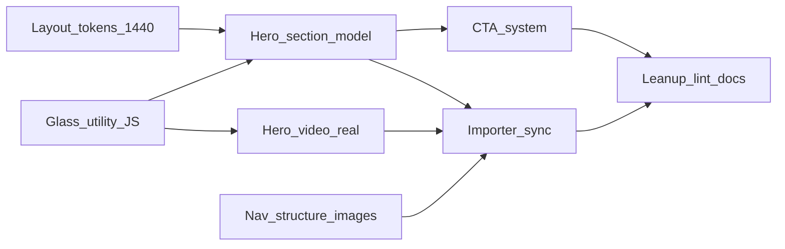

# User Prompts Only

Source: chat-history-2026-05-11_19-37-25.md
Prompts: 45

Exported: 2026-05-11 19:37:25 UTC
Session ID: 
User name: Gabriel Walt
User email: gwalt@adobe.com
Project: gabrielwalt/semrush
Preview URL: https://aem-20260508-1813--semrush--gabrielwalt.aem.page

---

## Prompt 1

# Homepage hero, nav, glass, and CTA overhaul

## 1. Main layout width (1440px “mp-container”)

- Introduce a clear token (e.g. `--layout-max-width: 1440px`) in [`styles/styles.css`](styles/styles.css) (and note in [`PROJECT-DESIGN.md`](PROJECT-DESIGN.md)).
- Apply it to the same conceptual shell as the header: e.g. keep [`blocks/header/header.css`](blocks/header/header.css) `max-width: 1440px` aligned to the token; set **`main > .section > div`** max-width to that token (today [`styles/styles.css`](styles/styles.css) uses `--content-max-width: 1200px` at line ~68 — decide whether to **replace** globally or scope 1440px to “marketing width” only; user asked for main container parity with original, so prefer **one** primary layout max-width unless inner reading columns need a narrower token).
- **Hero typography:** Remove the inner “extra” max-width on the hero text column ([`blocks/hero/hero.css`](blocks/hero/hero.css) `.hero > div:first-child` and subtitle `max-width`) so the H1 is not artificially narrower than the 1440 shell; rely on section + optional line-length token only if still needed for readability.

---

## 2. Hero content model (default content + placeholder block + `centered` section)

**Target DOM (EDS):** One `main` child `div` (section) containing:

1. `div.section-metadata` — row `Style` / `centered` (see [`scripts/aem.js`](scripts/aem.js) `readBlockConfig` + `decorateSections`: `style` becomes classes on `.section`).
2. Default content: `h1` + subtitle `p` only (no “Get insights” link in default content).
3. New block: **empty** table row (placeholder), e.g. block name `hero-insights` (exact name to register in block list / folder `blocks/hero-insights/`).

**JS:** Move the form logic out of [`blocks/hero/hero.js`](blocks/hero/hero.js) into [`blocks/hero-insights/hero-insights.js`](blocks/hero-insights/hero-insights.js) (or equivalent): on `decorate(block)`, build the same `.hero-search` UI as today, optionally call a tiny shared helper if both files must coexist temporarily. Apply shared glass class to the form wrapper (see §4).

**CSS:** Add `main .section.centered` rules in [`styles/styles.css`](styles/styles.css) (or a small dedicated sheet if you want isolation): `text-align: center`, flex column + align items center for default wrapper and block children so **H1, subtitle, and form** are centered by the section style, not by leftover `.hero` rules.

**Auto-block guard:** Update [`scripts/scripts.js`](scripts/scripts.js) `buildHeroBlock` so it does **not** prepend a synthetic `hero` when the homepage already has the new structure (e.g. detect `hero-insights` or `section-metadata` + `h1` in first sections).

**Drafts:** Rewrite [`drafts/index.plain.html`](drafts/index.plain.html) (and [`drafts/index-preview.html`](drafts/index-preview.html) if it mirrors structure) so the first hero area matches the above; split **logo marquee** and **hero-video** into their own sibling sections (today the draft nests marquee inside `.hero`, which is incorrect for the target model).

---

## 3. Hero video block: real video, no block background, shared glass

- [`blocks/hero-video/hero-video.js`](blocks/hero-video/hero-video.js): Replace image-only stub with `<video playsinline muted loop autoplay>` (respect `prefers-reduced-motion`: pause or show poster only). Set `src` from the **original page** video URL; keep `poster` from source if present.
- [`blocks/hero-video/hero-video.css`](blocks/hero-video/hero-video.css): Remove the full `.hero-video` gradient background; style a **glass frame** around the video only (wrapper class).
- **Importer:** [`tools/importer/parsers/hero.js`](tools/importer/parsers/hero.js) and the inline `heroParser` in [`tools/importer/import-homepage.js`](tools/importer/import-homepage.js): emit a `Hero Video` row with a `video` element (attributes from DOM), not only `<picture>`.

---

## 4. Single glass utility + JS application

- In [`styles/styles.css`](styles/styles.css) (or [`styles/brand.css`](styles/brand.css) if that is where Semrush-specific surfaces live), define **one** class (e.g. `.semrush-glass-surface`) inspired by the original `.mp-glass::before` recipe: layered linear-gradient, `backdrop-filter`, subtle border, radius, and optional inner shadow. Tune for a “macOS frosted” feel (stronger blur, softer highlight) without hurting contrast.
- Small shared module, e.g. [`scripts/glass.js`](scripts/glass.js): `export function applyGlassSurface(el)` that adds the class (and any wrapper structure if required).
- Call it from **hero-insights** decorate (form wrapper) and **hero-video** decorate (video wrapper). Remove duplicated glass CSS from [`blocks/hero/hero.css`](blocks/hero/hero.css) / promo-style duplicates only where it is safe and reduces duplication (do not rip glass off promo-cards unless out of scope).

---

## 5. Logo marquee

- [`blocks/logo-marquee/logo-marquee.css`](blocks/logo-marquee/logo-marquee.css): logos **black** (remove or replace `opacity: 0.3` grey treatment), **slower** animation (increase duration), add **edge fades** via `mask-image: linear-gradient(to right, transparent, black …)` or pseudo-element gradients on the track container.
- [`blocks/logo-marquee/logo-marquee.js`](blocks/logo-marquee/logo-marquee.js): keep lean; only adjust if DOM needs a wrapper for masks.

---

## 6. Nav: hierarchy, mega menu images, importer

**Content structure ([`drafts/nav.plain.html`](drafts/nav.plain.html)):** Under the middle “sections” column, nest items so **“Start Here”** (or the exact label from semrush.com — verify string) is the single top-level `li` with a nested `ul` containing Semrush One, Enterprise, Features, Request a Demo, Talk to Sales, etc. Remove reliance on `---` / multiple fragment sections for nav (single coherent tree).

**Header JS ([`blocks/header/header.js`](blocks/header/header.js)):** Adjust `buildMegaColumns` if the new nesting changes how `nav-mega-column` / `nav-mega-promo` are detected (today it keys off `li` with text nodes + child `ul`, or `picture` for promo). Goal: correct columns + promo tiles without depending on **bold** for layout.

**Mega menu images:** Compare each promo tile to semrush.com DOM; update authored `<picture>` / `src` in the nav fragment and any importer output so images match (not generic placeholders).

**Importer:** There is no separate `import-nav.js` in repo today ([`PROJECT-IMPORT.md`](PROJECT-IMPORT.md) still describes it as future). **Either** add a minimal nav path to the existing [`tools/importer/import-homepage.js`](tools/importer/import-homepage.js) pattern (new parser + template entry for a nav URL) **or** document that nav is hand-maintained but add a **`parseNav` / `nav` parser** that emits the same nested structure from the live header DOM so re-imports stay consistent. Whichever path, keep **one** script philosophy per AGENTS.

---

## 7. CTA system (nav height, enterprise pink, solutions carousel)

- **Nav tools ([`blocks/header/header.css`](blocks/header/header.css)):** Match **60px** control height to global buttons ([`styles/styles.css`](styles/styles.css) `a.button` / `button.button` height). Use `inline-flex`, consistent `padding`, `min-height`, `box-sizing`, and line-height so Log in / Sign up match in-page CTAs.
- **Enterprise promo ([`blocks/promo-cards/promo-cards.css`](blocks/promo-cards/promo-cards.css)):** `Book a demo` is authored as `<strong><a>` → `.button.primary` → **accent fill**. Override for `.promo-cards-enterprise` with full specificity so primary on dark = **outline / transparent / white** treatment (not pink); align hover/focus with source.
- **Solutions slider ([`blocks/solutions-slider/solutions-slider.css`](blocks/solutions-slider/solutions-slider.css) + content):** Parser already outputs `h3` + `p` ([`tools/importer/parsers/solutions-slider.js`](tools/importer/parsers/solutions-slider.js)); [`drafts/index.plain.html`](drafts/index.plain.html) still shows `h4`/`h5` in slides — **regenerate or hand-fix** draft so markup matches CSS. Then tune flex, `.button-wrapper`, and widths so carousel CTAs match source (no overflow, consistent pill).
- **Consolidate:** Add a short “CTA contract” in [`styles/styles.css`](styles/styles.css): base `.button` rules where possible; context overrides only in `header`, `.solutions-slider`, `.promo-cards-enterprise`, etc., using shared variables (`--cta-height`, radius) to avoid one-off heights.

---

## 8. Importer: homepage hero matches new structure

- Replace monolithic “Hero” table output with: **section wrapper is not emitted by a single table** — the bulk importer may only output blocks. Practical approach: **extend `heroParser`** to output, in order: (1) optional `Section Metadata` as a dedicated block if your pipeline supports it, or rely on **section transformer** in `beforeTransform` to inject `section-metadata` + wrap `.mp-hero` region; (2) plain cells for default heading copy; (3) `hero-insights` empty block; (4) `hero-video` with `<video>`. If section injection is too heavy, keep **drafts as canonical** for section shape and ensure **parser output matches** what `drafts/index.plain.html` will contain after one import pass.
- Keep [`tools/importer/parsers/hero.js`](tools/importer/parsers/hero.js) and [`tools/importer/import-homepage.js`](tools/importer/import-homepage.js) **in sync** (today they duplicate the same `heroParser`).

---

## 9. Lean-up pass (CSS/JS touched)

- Remove dead rules after hero split (old `.hero` form styles → move to `hero-insights` or delete).
- Deduplicate glass snippets only where the new utility covers them.
- Avoid `nth-child` layout coupling per AGENTS; prefer classes from `decorate`.

---

## Dependency order (recommended)

---

## Prompt 2

Verify that we achieved following outcomes:

### 1. Simplification / cleanup (stated twice)
Intent: Treat "leaner is better" as an explicit quality bar. After feature work, review all CSS/JS you've touched, remove duplication, dead paths, and over-specific rules so the codebase stays easy to maintain.

### 2. Nav content structure (nesting + `---`)
Intent: The nav fragment should reflect the real information hierarchy: items like Semrush One, Enterprise, Features, Request a Demo, Talk to Sales should read as children of one parent (e.g. "Start Here"), not as a flat list split by document structure. Remove `---`-driven splits so the nav is one coherent tree, not multiple artificial sections.

### 3. Bold in nav
Intent: Bold is optional for authors, not a layout or behavior contract. Styling and mega-menu logic should work from structure (lists, nesting, classes from decorate), not from "this must be bold to look right."

### 4. Mega menu images
Intent: Visual parity with semrush.com: the promo/column images in the mega menu should be the correct assets, chosen by comparing to the live site, not placeholders or wrong crops.

### 5. Importer and nav
Intent: Single source of truth: whatever nav structure you decide (nested lists, promos, etc.) must be what the importer outputs on re-import---no manual-only fixes that the next import breaks.

### 6. Hero layout / max-width (H1 vs `mp-container`)
Intent: Match the original layout model: the page sits in a ~1440px-wide shell; the H1 should not sit in an extra inner max-width that the original doesn't use. Simplify the hero by relying on that shell and introduce the same main content max-width pattern project-wide where appropriate.

### 7. Hero content model + `centered` section
Intent: Separate concerns in content: headline + subtitle stay default content (not a `hero` block). The "Get insights" UI is its own block that can be empty in the document and filled/initialized by JS. Section-level styling (`centered`) should be what centers the stack (H1, subtitle, form block)---not scattered per-element hacks.

### 8. Glass on the Get insights form
Intent: The form should look like the original glass (your reference: `.mp-glass::before`). Optionally exceed that with a clearer "Mac-like" frosted treatment if it still reads as Semrush.

### 9. Hero-video: no block bg + shared glass
Intent: No full-bleed gradient/background on the `hero-video` block itself; the glass treatment frames the video. Define the glass once (one class / one recipe) and apply it from JS wherever needed (form + video), so you don't copy-paste the same CSS in multiple blocks.

### 10. Hero-video: real video
Intent: Behavioral and content parity: not a static image masquerading as video---a real `<video>` using the same source as the original page, playing as the original does (within sensible autoplay/accessibility constraints).

### 11. Marquee logos
Intent: Motion and look match the original: logos black (not greyed), slower scroll, and soft fade at the left/right edges of the track so it doesn't look like a hard clip.

### 12. CTAs (four sub-intents)
Intent: Holistic CTA system that matches semrush.com everywhere:
-   Nav CTAs: Same visual height / weight as primary buttons elsewhere---not undersized pills.
-   Enterprise promo card ("Bigger scale..."):** CTA should not pick up the wrong pink/accent primary treatment; it should match the dark-card CTA on the original.
-   Solutions carousel: CTAs should not look broken in that layout (overflow, alignment, wrong button variant).
-   Overall: One consistent set of rules for buttons in default content, header/footer, and inside blocks (including carousels), with only scoped overrides where the surface really differs.

### 13. Final simplification pass
Intent: Same as (1): after all of the above, another pass to trim and unify what changed so the implementation stays minimal and coherent.

---

## Prompt 3

- Ensure the nav big menu content is containing both images, the right images and the corresponding image labels from the original big menu. (it should have also the text "Try Semrush One for Free"\n "The leading platform that unifies SEO authority and AI visibility." and "Get Your Ticket Now"\n "One day. Real strategies. Built for marketers who play to win."\n "October 13, 2026"
"London, UK").
- Measure precisely the dimensions and paddings of the CTA in the nav header and ensure that we implemented the same.
- Ensure that the placement of the nav dropdown chevrons is the same as on the original page (verify for the open and close states).
- Move the text strings of the "hero-insights" app like "Enter your website" and "Get insights" into the content of the placeholder block, and ensure the app uses those strings from the content.
- Look very carefully at the style of the hero-insights app and ensure that we have the same. Check the rounded corners of the whole and its glass effect. Take a screenshot, analyze the look of the screenshot, inspect the DOM and CSS of the original implemenantation and ensure that you have a full understanding of how it works and how to implement it.
- Measures precisely the sizes of the logos in the marquee and ensure that we implemented the same.
- Precisely check the backgrounds applied to the content and ensure that we have the same.

---

## Prompt 4

Critique every block of the index page on desktop, tablet and mobile breakpoints. Where you see discrepancies, take a close look at the styles from the original site to avoid fixing them randomly. Try to truly understand how the layout was achieved on the original page and think of how the same thing could be achieved with the structure that we have in EDS. Use your skills to the max extent to fix things, and then take a step back to evaluate whether they will solve the problem at hand, or whether something slightly different needs to be done.

---

## Prompt 5

carefully verify the backgrounds thoughout the page

---

## Prompt 6

- Measure precisely the dimensions and paddings of the CTA in the nav header and ensure that we implemented the same.
- Ensure that the placement of the nav dropdown chevrons is the same as on the original page (verify for the open and close states).
- Move the text strings of the "hero-insights" app like "Enter your website" and "Get insights" into the content of the placeholder block, and ensure the app uses those strings from the content.
- Look very carefully at the style of the hero-insights app and ensure that we have the same. Check the rounded corners of the whole and its glass effect. Take a screenshot, analyze the look of the screenshot, inspect the DOM and CSS of the original implemenantation and ensure that you have a full understanding of how it works and how to implement it.
- Measures precisely the sizes of the logos in the marquee and ensure that we implemented the same.
- Carefully check the backgrounds applied to the content and ensure that we have the same.

---

## Prompt 7

iterate on the header:
- check how it looks on the original page
- see that the items "Products", "Pricing", "Resources" and "Enterprise" aren't properly placed
- these items should be centered in the middle of the top nav
- their chevrons aren't displayed next to each item
- the "Enterprise" item should have an arrow next to it

this was working previously but something broke

---

## Prompt 8

Iterate on how the two nav-mega-promo are being displayed compared to the original site.

---

## Prompt 9

Make the hero-insights as wide as on the original page, consider looking at all breakpoints to verify how wide it should be.

---

## Prompt 10

Make the country switcher of the hero-insights work as on the original site.
Also see the horizontal spacing that the original site is applying to CTAs that are horizontally one next to the other, and apply that gap globally, ensuring that this gets applied to the "Log In" and "Sign Up" buttons of the top nav, as well as to the "Enter your website" search input and to the "Get insights" button that follows.

---

## Prompt 11

On the homepage, in addition to the background that is applied to the page, there's also an SVG:
@media (min-width: 1440px) {
    .mp-hero {
        background: url(/static/images/pattern-hero.7635a3f….svg) 2px calc(50% - 20px) repeat-x;
    }
}
Inspect in full detail how that background works on all breakpoints and implement the same to our page. It's only the homepage that has that specific background, so find a good way how we can have it only on that page.

---

## Prompt 12

It seems to me that the horizontal spacing between the "Log In" and "Sign Up" buttons of the top nav is a bit too wide. Apply the same measurement as from the original site. That horizontal gap should be the same as between the the "Enter your website" search input and to the "Get insights" button of the hero-insights switcher.

---

## Prompt 13

Investigate the hover color that the different CTAs have on the original site and implement the same.
Make that there's an animation when the bg color changes.

---

## Prompt 14

Rename the hero-insights block to "insights-widget" and refactor it accordingly.
Make that the two strings aren't separated by "|" characters but rather by new lines.

In the content, include also the hero-video block in the centered section that precedes as that block is centered too on the home page. Ensure that our import script properly maps and imports that content as we need it to be. Test it to be sure also for the header and footer and improve the import script where needed so that it generates the exact content structure that we have now.

---

## Prompt 15

Rename the logo-marquee block to just marquee and make its implementation generic of the concept of logos: it could be texts too. What matters is that each entry is on a new line, and it will create a marquee out of whatever is separated between new lines.
Compare how the marquee displays visually between the original site and our implementation, and notice how the height of the logos on the original site. Ensure we display the marquee items with the same height.
Compare how the marquee on the original size has the items spaced, and apply also the same spacing to the elements of our marquee.
Compare also how they fade in and out on each side and ensure we have the same for that too.

---

## Prompt 16

From the original site, check how much vertical spacing there is generally between the blocks.
Implement for us too a default rule of how much margin top and bottom there should be between each subsequent block.
For sections, make that the first and last items of the sections have no margin top nor bottom, but instead add the same amount of padding top and bottom to the sections.
Don't apply any margin top nor bottom to the sections.
Describe somewhere this design system to define the vertical spacing of blocks and sections as blocks are nested in sections.

---

## Prompt 17

Refactor the structure of the mega menu content as follows:
Describe the structure via title sizes:
- H2 for "Products", "Pricing" etc
- H3 for "Start Here", "Find the Right Tools" etc
- then a regular UL for "Semrush One", "Enterprise" etc
- allowing therefore to display the last column as regular image + bold text + regular text or similar
- "Enterprise" is then simply an H2 with an external link

To display the top items that are constantly displayed in the top nav, we have two options, and I want you to choose the best one for EDS:
- either it aggregates the H2 elements of the mega menu content structure
- or we start the nav file with another simple UL list for the top items

---

## Prompt 18

I don't know how you see the marquee of the original site, but it looks very different from our marquee…

---

## Prompt 19

You implemented and documented a vertical spacing design system, but I don't see any vertical spacing between the blocks of the index page… The insights-widget is vertically touching the hero-video, etc… What's missing? Implement it.

---

## Prompt 20

Animate the opening and closing of the mega-menu and also add a rounded bottom left and bottom right corners of it as on the original site.

---

## Prompt 21

On the original page, the content area has a max width. Check what that is and implement the same…

---

## Prompt 22

what were things that we had to iterate on the most, and what learnings would be worth to be added to the project learnings accordingly?
explode the project learnings into a folder with a file for each learning and a good index, and add instructions for yourself in the AGENTS.md to search for the corresponding learnings based on the learnings index whenever you get to a problem that sounds somewhat similar. Also add instructions for yourself to update existing learnings when needed, improving also their brief descriptions in the learnings index whenever you think that it could have served you better if it were better formulated to make the best use of them (they should be formulated similar to skills).
Or, actually thinking as I'm writing this, should we transform the learnings in a database of skills: creating a skills folder in which you constantly create new skills for every learning, also constantly improving skills after you used them if you noticed that something was missing, you add it, or if something is poorly formulated, you improve it, or if something was too obvious and wordy, you compact it… or if two skills are very alike, you merge them, etc. Keeping the skills folder up-to-date at all time.
That way, you also wouldn't need to create an index of these learnings, because if these are recognized by yourself as proper skills, you generally just load their headers in your context and expand on them as you go… would that make sense that you become a learning agent that for everything that you struggled with create a skill file for the future to be working more smoothly?
If that makes sense, research how others have created some lean instructions to get yourself to work that way and create important instructions in your AGENTS.md to add these instructions for yourself.
Use your skill writing skills whenever you need to write skills.

---

## Prompt 23

continue

### Subagent [2026-05-11 18:36:32 UTC]

Research self-learning patterns

### Subagent [2026-05-11 18:36:36 UTC]

List .claude directories and memory files

### Subagent [2026-05-11 18:36:42 UTC]

List .claude directory in workspace

### Subagent [2026-05-11 18:36:42 UTC]

Check for memory directory

### Subagent [2026-05-11 18:36:48 UTC]

List plugins directory

---

## Prompt 24

continue

---

## Prompt 25

continue

---

## Prompt 26

Review and improve the skills we currently have.

---

## Prompt 27

Like you had in your PROJECT-LEARNINGS.md, create a skill template that distills all the skills that you need to create a new skill

---

## Prompt 28

continue

---

## Prompt 29

anything you think would need to be improved for this to work smoothly?

---

## Prompt 30

continue

---

## Prompt 31

would it make sense to convert all project learnings into skills, or how to segregate the two into different use-cases with distinct instructions to yourself?

---

## Prompt 32

add as CSS guideline to yourself in the AGENTS.md to avoid as much as possible the use of !import rules, trying cleaner strategies insteaad.

---

## Prompt 33

In the header, we're missing an entire column: Top Apps
- AdClarity
- Exploding Topics
- SERP Gap Analyzer
- Other apps

Also the Platform entry is missing an entry.

Improve the import script so that it never misses anything and covers all menu entires, importing them all to the nav.

---

## Prompt 34

In the header, we're missing an entire column: Top Apps

AdClarity
Exploding Topics
SERP Gap Analyzer
Other apps
Also the Platform entry is missing an entry.

Improve the import script so that it never misses anything and covers all menu entires, importing them all to the nav.

---

## Prompt 35

continue

---

## Prompt 36

Use your skill writing skills whenever you need to write skills.

Ensure our system of instructing yourself to write skill to capture learnings is well structured and has clear instructions for yourself to create, maintian and improve continuously in an autonomuous fashion your own set of skills.

---

## Prompt 37

continue

---

## Prompt 38

all good? where do we stand?

---

## Prompt 39

continue

---

## Prompt 40

continue

---

## Prompt 41

continue

---

## Prompt 42

update your project status

---

## Prompt 43

continue

---

## Prompt 44

continue

---

## Prompt 45

continue

---
